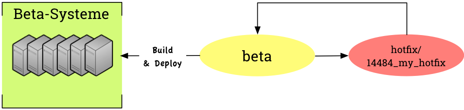
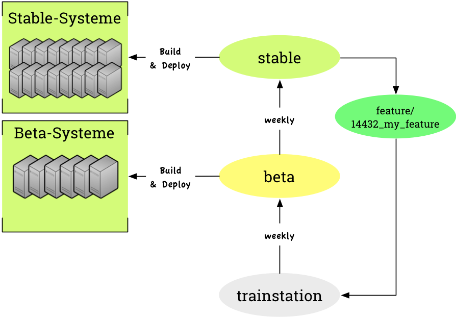

# Git Branching Workflow @ plentymarkets

# Hotfix for Stable

## Wofür?

Für alles, das *keine* Beta-Phase durchlaufen kann und *direkt* die Kunden auf **stable** erreichen muss.

- Wichtige Fixes
- Terminkritische Entwicklungen (z.B. Änderung einer Schnittstelle)
- Wichtige Erweiterungen (z.B. wenn etwas vergessen worden ist)

- Branch von **stable** abziehen
- Ordner „hotfix“ + Ticket-ID („hotfix/14412_my_feature“)
- Test (PHP/UI) isoliert auf dem Branch
- Merge in **stable** so schnell es geht
-  Wenn es ein Projekt bzw. Changelog geben soll geben soll:
 - Release Pipeline „In Stable“
 - Im Projekt die Unterversion (dritte Versionsnummer) und Release-Datum ergänzen
 - Ggf. Changelog veröffentlichen
- Der Fix wird nach ca. 5 Minuten automatisch auf **beta** gemerged
- **stable** und **beta** müssen gebaut und verteilt werden

## FAQ

> Muss ich den Code auf **beta** nach dem automatischen Merge von **stable** nach **beta** noch einmal testen?

Im Normalfall: Nein. Wir haben schon früher bei unseren Cherry-Picks zwischen den Versionen bemerkt, dass es praktisch keine Fehler gab. Die Versionen liegen i.d.R. nicht weit auseinander. Durch den Merge kann auch nichts vergessen werden.
Im Einzelfall: Es kann sein, dass auf **beta** sich eine Logik geändert hat, für die der Fix nicht passt.

> Können beim automatischen Merge von **stable** in **beta** Konflikte auftreten?

Ja, beim automatischen Merge von **stable** in **beta** kann es zu Konflikten kommen. In diesem Fall werden getrennte E-Mails an die Verursacher (die letzten Committer) versandt.

# Hotfix for Beta

## Wofür?

Für alles, was *direkt* die Kunden auf **beta** erreichen muss.

- Wichtige Fixes, die nur auf **beta** bestehen (Fehler, die es auch auf **stable** gibt, müssen dort behoben werden)
- Terminkritische Entwicklungen (z.B. für einen bestimmten Kunden, dessen System auf **beta** ist)
- Wichtige Erweiterungen (z.B. wenn etwas vergessen worden ist)

- Branch von **beta** abziehen
- Ordner „hotfix“ + Ticket-ID („hotfix/14484_my_hotfix“)
- Test (PHP/UI) isoliert auf dem Branch
- Merge in **beta** so schnell es geht
-  Wenn es ein Projekt bzw. Changelog geben soll geben soll:
 - Release Pipeline „In Beta“
 - Im Projekt die Unterversion (dritte Versionsnummer) und Release-Datum ergänzen
 - Ggf. Changelog veröffentlichen
- **beta** muss gebaut und verteilt werden

# Feature Development

## Wofür?

Für alles, was eine *Beta-Phase* durchlaufen soll.

- Features
- Änderungen
- Verbesserungen
- Minor Fixes

- Branch von **stable** abziehen
- Ordner „feature“ + Ticket-ID („feature/14432_my_feature“)
- Good Practice: **stable** regelmäßig mergen, um Fixes zu erhalten
- **beta** darf auch rein gemerged werden, wenn man etwas von dort benötigt
- Test (PHP/UI) isoliert auf dem Branch
- Merge in **trainstation**, wenn alles *fertig* ist (Test, Doku, Changelog)
- Release Pipeline: „Next Beta“ , wenn es in die nächste Beta soll. „Fertig & Wartet“, wenn nicht.
- Der Rest läuft automatisch :-)

## FAQ

> Was ist, wenn meine Entwicklung doch *direkt* in **stable** oder **beta** muss?

Wenn **beta** nicht in den Branch gemerged worden ist, kann zurück in **stable** gemerged werden. Für **beta** ist das egal, da **beta** bereits alles von **stable** enthält.

> Kann es Konflikte beim Merge in **trainstation** geben?

Ja, hier könnte es beim Merge zu Konflikten kommen, die gelöst werden müssen.

> Kann es Konflikte mit Fixes geben, die von **stable** oder **beta** kommen?

Ja, beim automatischen Merge von **stable** in **beta** kann es zu Konflikten kommen. In diesem Fall werden getrennte E-Mails an die Verursacher (die letzten Committer) versandt.

# Detaillierte Informationen

## [Klick!](https://draftin.com/documents/529914?token=vJa8kns0Ubfg9PoEJQhajhVZ_k7wv25Zt6MnQEbRat7XoSMN0Zp-ggTqzfGuVCRmGk_-44fFii9mamR7REY8Vnc)