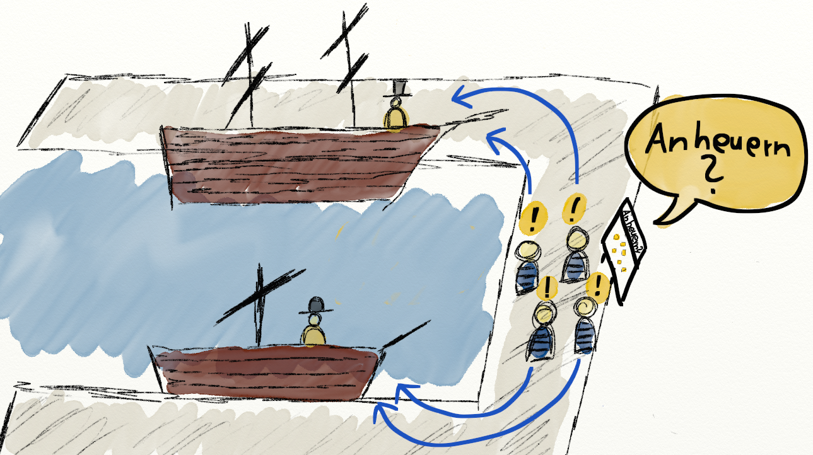

#Plentymarkets Workflow Refactoring

##So sieht's aus:

##Was kann verbessert werden?

##Weniger "Trichter"
###... es sind Flaschenhälse, die uns bremsen

##Weniger "Hüte"
###... reduziert den Kommunikations-Overhead

##So könnte es gehen:

##Pro & Contra

##Pro
---
####Verantwortung ist klar
- "End-to-End Responsibility"
- Alles aus <u>einer</u> Hand: Modell-Planung & UI-Entwurf
---
####Vieles wird einfacher
- Weniger Overhead für <u>Planung</u>
- Weniger Overhead für <u>Kommunikation</u>
- Schnelle <u>Entscheidungen</u></li>
- Weniger <u>Fehler</u> und <u>Missverständnisse</u> bei Planung, Entwicklung & Test
- Vereinfachung für QA & Support: <strike>"GWT oder PHP Bug?!"</strike> Feature XY Bug!

##Contra
---
####Einheitlichkeit der UI muss erhalten bleiben
- Ich liefere einen <u>Styleguide</u>
- Ich leiste gerne <u>Hilfe</u>
- Wichtig: <u>Pragmatisch</u> sein. Wir brauchen keine finalen Designs, sondern nur Mockups!
---
####Belastung der PHP-PLs
- Nicht jedes Projekt benötigt <u>wirklich</u> einen UI-Entwurf
- Arbeit mit Balsamiq Mockups ist leicht erlernt und effizient
- Ich stelle euch eine zusätzliche Widget-Library bereit!
---
####Verteilung der UI-Ressourcen
Hier liefere ich euch gleich eine Lösung :-)

#UI-Ressourcen verteilen

##Eine "maritime Metapher"
##(weil ich Ostfriese bin)

##Im Hafen:
###Kapitäne suchen Matrosen für ihr Schiff

## Das ist ein "Push-System" ...

## Push-System =

##Alternative?

##Die "Matrosen-Börse"

##Wieder im Hafen:
### Die Matrosen suchen sich ihre Schiffe selbst

## ... das ist ein "Pull-System".

## Pull-System =

##Was hat das mit uns zu tun?!

##Konkret kann das so aussehen:

##Projekt-Post-It

- Ein Post-It pro benötigtem UI-Entwickler
- Board hängt neben dem GWT-Board. Übersicht bleibt erhalten!
- Mehrbedarf? Hänge ein Post-It dazu!