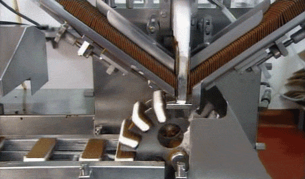

#Plentymarkets Workflow Refactoring

##Ist-Zustand:

##Was kann verbessert werden?

##Weniger "Trichter"
###... es sind Flaschenhälse, die uns bremsen

##Weniger "Hüte"
###... reduziert den Kommunikations-Overhead

##So könnte es gehen:

##Pro & Contra

##Pro
###Was ist besser?
- "End-to-End Responsibility"
- Alles aus <u>einer</u> Hand: Modell-Planung & UI-Entwurf
- Weniger Overhead bei <u>Planung</u>
- Weniger Overhead bei <u>Kommunikation</u> während des Projekts
- Schnellere <u>Entscheidungen</u></li>
- Weniger <u>Fehler und Missverständnisse</u> zwischen UI und Model
- Vereinfachung für QA & Support: <strike>"GWT oder PHP Bug?!"</strike> Feature XY Bug!

##Contra
###Was könnte uns herausfordern?
- <u>Einheitlichkeit der UI</u> muss erhalten bleiben
 - → Ich liefere einen "Styleguide"
 - → Ich leiste gerne Hilfe
 - <u>Wichtig:</u> Wir brauchen keine finalen Design-Entwürfe, sondern nur "Mockups"!
- <u>Mehraufwand für UI-Entwürfe</u> muss eingerechnet werden
 - → Nicht jedes Projekt benötigt <u>wirklich</u> einen UI-Entwurf
 - → Arbeit mit Balsamiq Mockups ist effizient und schnell erlernt (Drag & Drop)
 - → Ich stelle euch eine zusätzliche Widget-Library bereit!
- <u>Verteilung<u/> der UI-Ressourcen
 - → Hier liefere ich euch gleich eine Lösung :-)

#UI-Ressourcen verteilen
##Weil ich Ostfriese bin: Eine "maritime" Metapher :-)

##Im Hafen:
###Kapitäne suchen Matrosen für ihr Schiff

## Das ist ein "Push-System" ...

## Push-System =

##Noch mal im Hafen:
### Matrosen suchen sich ihre Schiffe selbst

## ... das ist ein "Pull-System".

## Pull-System =

##Was hat das mit plentymarkets zu tun?!

##Konkret das:
