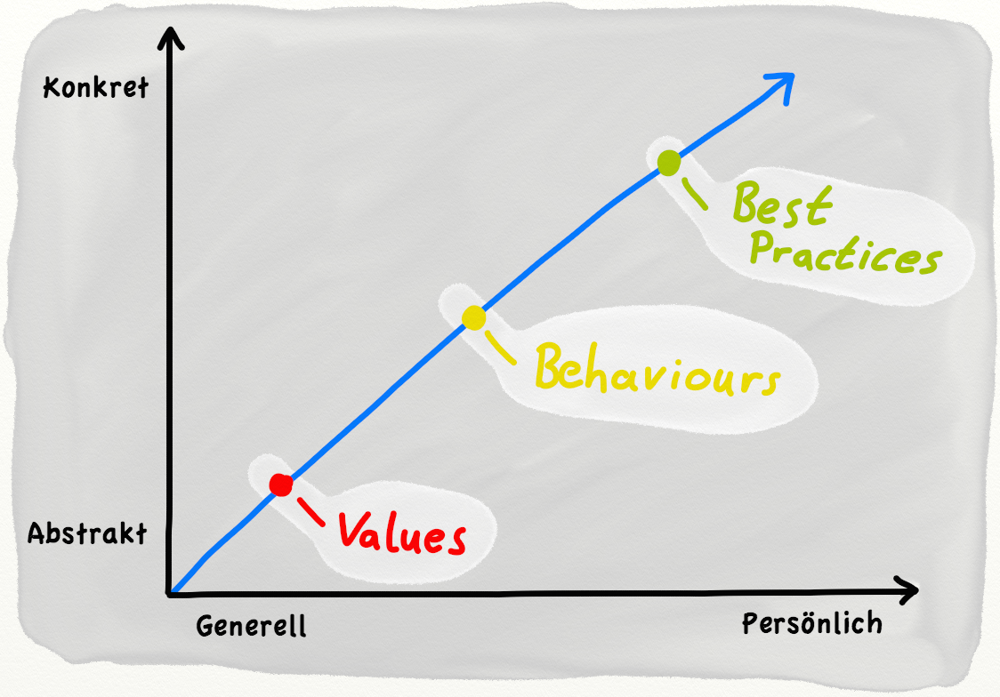

# Values, Behaviors, Best Practices

## Was sind unsere "Values"?
// TODO

## Was sind unsere "Behaviours"?
// TODO

## Was sind unsere "Best Practices"?
// TODO

## Die Trampelpfad-Theorie
// TODO
Als Beispiel hierfür führt Rudi Keller die Trampelpfadtheorie an: Über den Universitätscampus zieht sich ein Netz von Trampelpfaden, welche die kürzesten Verbindungen zwischen den wichtigsten Gebäuden und Einrichtungen darstellen. Dieses Netz ist sehr viel logischer und ökonomischer angelegt, als die vom Architekten geplanten Pflasterwege. Obwohl zur Erzeugung dieser Trampelpfade weitaus weniger Verstand benutzt wurde, als zum Anlegen der Pflasterwege, ist das System doch sehr viel rationeller als die künstlichen Wege. Die Invisible-hand-Theorie zu diesem System ist also folgende: Zu Beginn steht die Hypothese, dass die meisten Menschen kürzere Wege längeren vorziehen. Es lässt sich allerdings beobachten, dass die gepflasterten Wege dieser Tendenz nicht entsprechen, da sie oft nicht die kürzesten Verbindungen zwischen den häufigsten Anlaufstellen der Studenten darstellen. Es ist allgemein bekannt, dass der Rasen an Stellen, an denen er häufig begangen wird, verkümmert. Keller schließt daraus, dass das System der Trampelpfade die nicht-intendierte kausale Konsequenz derjenigen (intentionalen, finalen) Handlungen ist, die darin bestehen, bestimmte Ziele zu Fuß zu erreichen unter der Maxime der Energieersparnis.