# Workflow Refactoring

## So sieht's aus:
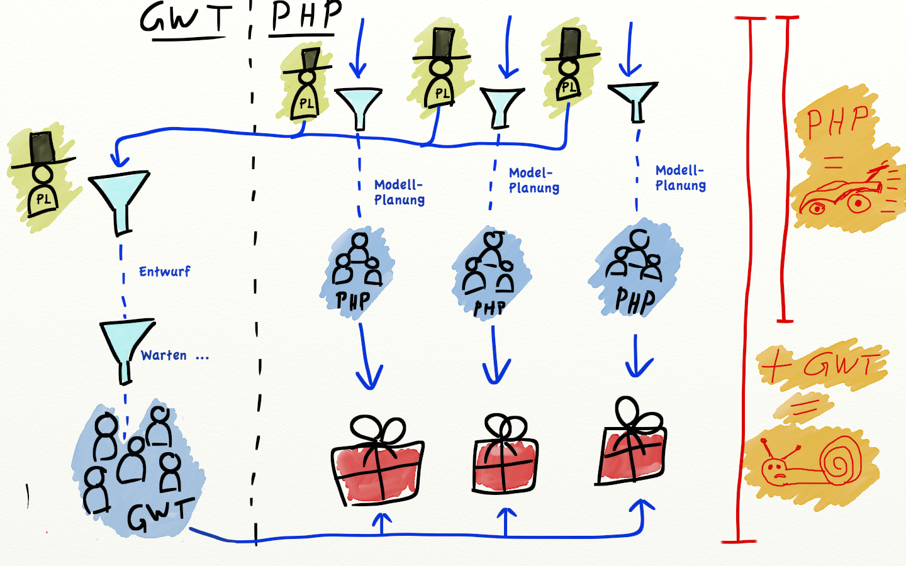

## Was kann verbessert werden?

## Weniger "Trichter"
### ... es sind Flaschenhälse, die uns bremsen
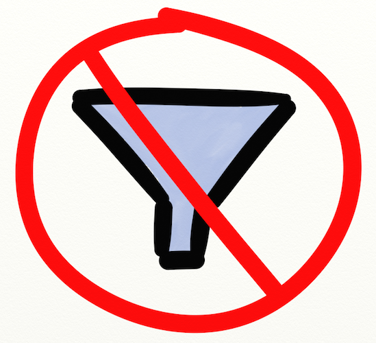

## Weniger "Hüte"
### ... reduziert den Kommunikations-Overhead
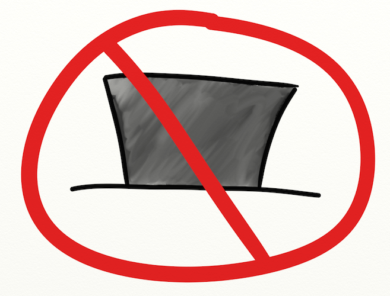

## So könnte es gehen:

## Pro & Contra

## Pro
---
#### Verantwortung ist klar
- "End-to-End Responsibility"
- Alles aus <u>einer</u> Hand: Modell-Planung & UI-Entwurf
---
#### Vieles wird einfacher
- Weniger Overhead für <u>Planung</u>
- Weniger Overhead für <u>Kommunikation</u>
- Schnelle <u>Entscheidungen</u></li>
- Weniger <u>Fehler</u> und <u>Missverständnisse</u> bei Planung, Entwicklung & Test
- Vereinfachung für QA & Support: <strike>"GWT oder PHP Bug?!"</strike> Feature XY Bug!

## Contra
---
####Einheitlichkeit der UI muss erhalten bleiben
- Ich liefere einen <u>Styleguide</u>
- Ich leiste gerne <u>Hilfe</u>
- Wichtig: <u>Pragmatisch</u> sein. Wir brauchen keine finalen Designs, sondern nur Mockups!
---
####Belastung der PHP-PLs
- Nicht jedes Projekt benötigt <u>wirklich</u> einen UI-Entwurf
- Arbeit mit Balsamiq Mockups ist leicht erlernt und effizient
- Ich stelle euch eine zusätzliche Widget-Library bereit!
---
####Verteilung der UI-Ressourcen
Hier liefere ich euch gleich eine Lösung :-)

# Transition
## Vieles bleibt beim Alten!
- Alle PHP-Teams bleiben bestehen
- Client-Team bleibt bestehen
- GWT-Team bleibt bestehen
- Keine personellen Veränderungen

## <u>GWT-interne</u> Projekte und Tickets gibt es weiterhin
GWT-Board & Workflow bleiben bestehen

---

## Bei <u>teamübergreifenden</u> Projekten sieht das anders aus
Hier ändert sich einiges!

# Cross-funktionale Teams
<blockquote>Wir organisieren die Menschen nicht mehr um Technologien, sondern um Projekte.</blockquote>

// TODO Bild von einem Cross-funktionalem Team, GWT/PHP/Client, dem Projektleiter (Pfeil: Was?), dem GWT-Leiter (Pfeil: Wie?)

- Mehr Zusammenarbeit
- Gräben zuschütten
- Weniger "die" und "wir, mehr "wir"

# ☠ GWT must die ☠
## Wir brauchen ein neues Selbstverständnis
- "GWT-Gilde" — Die Spezialisten ihres Handwerks
- Helfer für die Teams
- Variable Verteilung auf die Projekt-Teams, je nach Bedarf

// TODO Bild von der Organisationsmatrix

# GWT lebt
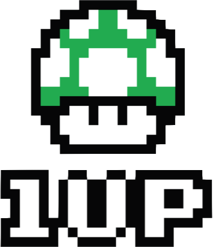

# Styleguide
Jeder von uns kann und soll daran mitwirken!

// TODO Bild von einem Heft wo "Styleguide" oder "Manual" drauf steht

# Blog
Ankündigung von Neuerungen und Änderungen an der GWT-Codebasis

// TODO Bild von einem Megaphon

# Confluence
Wissen langfristig festhalten und pflegen

// Bild von einem Eimer, in den Ideen fallen
// Oder mehrerer Bahnen, die in eine Verlaufen und in den Eimer fallen
// Auf dem Eimer könnte das Confluence-Logo stehen, wenn nicht zu kompliziert

# Retrospektiven
Kontinuierliche GWT-interne Verbesserung

// TODO Bild vom continuous improvement cycle

# Internal Unconferences
"Nicht-Konferenz" aller GWT-Entwickler (und Interessierter)
<blockquote>An unconference is like a normal conference but with no predefined agenda, no predefined list of speakers, no slides, and…er… actually it’s not very much like a normal conference at all! It’s more like an alternative to a conference. If the purpose of a conference is to collaborate and communicate, then an unconference will often fulfill the same purpose in a more simple, fun, and effective way!—Henrik Kniberg</blockquote>

- Styleguide
- Blog
- Wiki
- Code Reviews
- Regelmäßige GWT-interne Retrospektive
- Regelmäßige "Internal Unconferences"

# Wie verteilen wir die GWT-Entwickler auf die Projekt-Teams?
## Eine "maritime Metapher"
### (weil ich Ostfriese bin)

##Im Hafen:
###Kapitäne suchen Matrosen für ihr Schiff
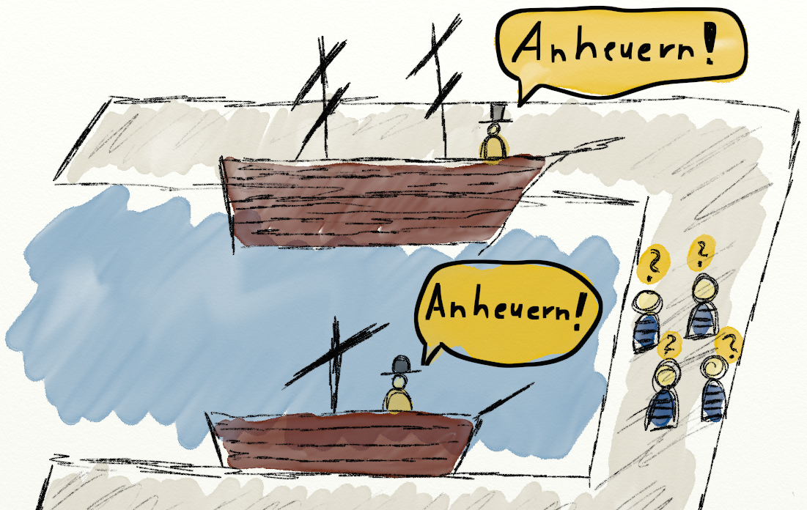

## Das ist ein "Push-System" ...

## Push-System =

## Alternative?

## Die "Matrosen-Börse"
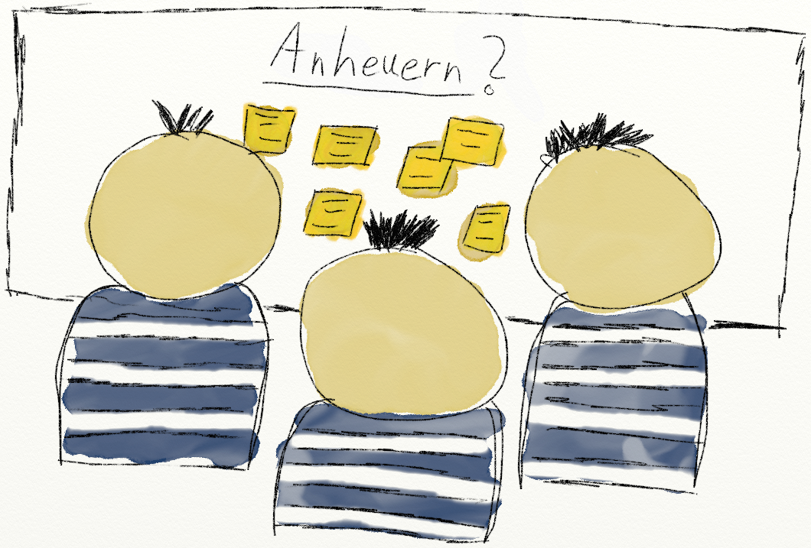

## Wieder im Hafen:
### Die Matrosen suchen sich ihre Schiffe selbst
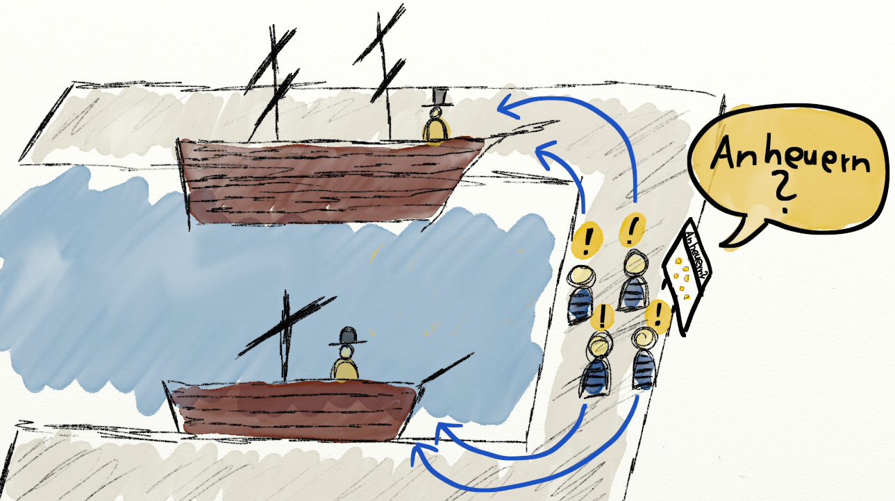

## ... das ist ein "Pull-System".

## Pull-System =
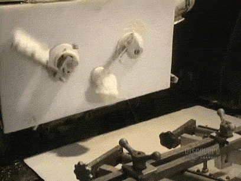

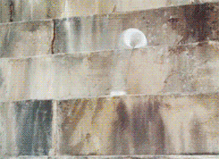
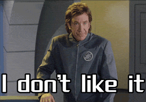

## Was hat das mit uns zu tun?!

## Konkret kann das so aussehen:
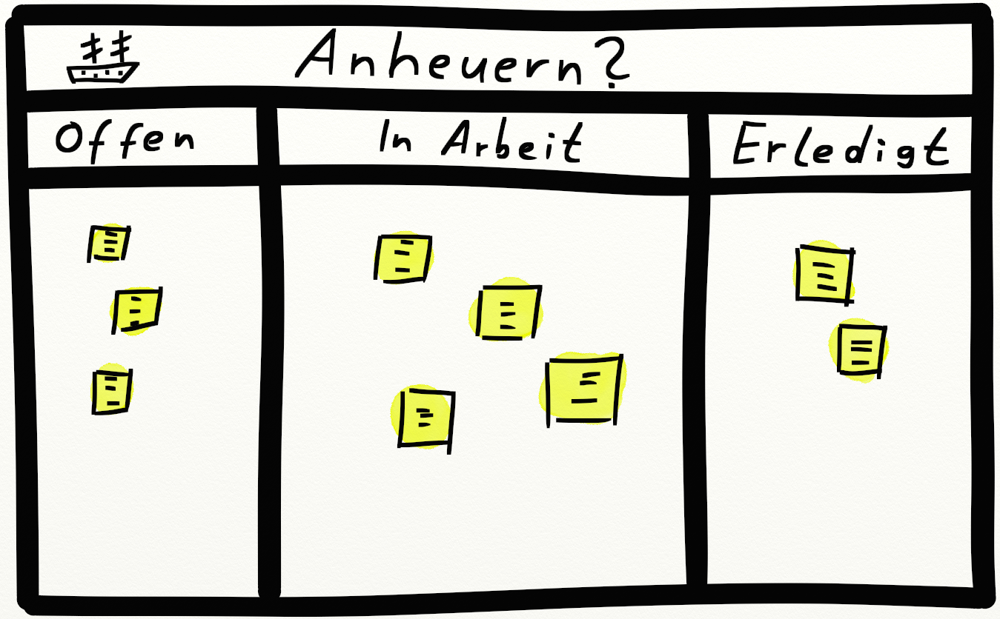

## Projekt-Post-It
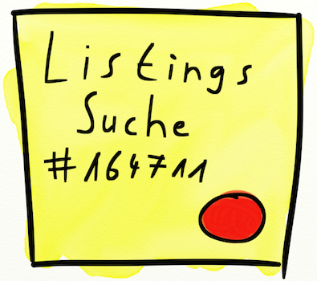

- Ein Post-It pro benötigtem UI-Entwickler
- Board hängt neben dem GWT-Board. Übersicht bleibt erhalten!
- Mehrbedarf? Hänge ein Post-It dazu!