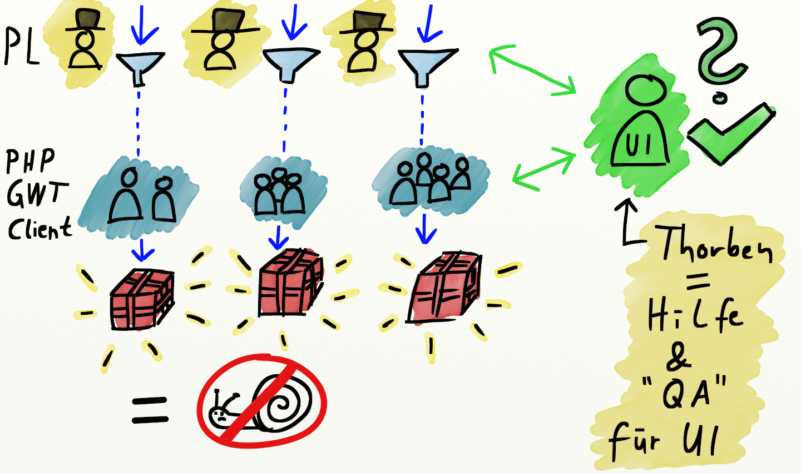

# Workflow Refactoring

## So sieht's aus:

## Was kann verbessert werden?

## Weniger "Trichter"
### ... es sind Flaschenhälse, die uns bremsen

## Weniger "Hüte"
### ... reduziert den Kommunikations-Overhead

## So könnte es gehen:

# Pro & Contra

## Pro
---
#### Verantwortung ist klar
- "End-to-End Responsibility"
- Alles aus <u>einer</u> Hand: Modell-Planung & UI-Entwurf
---
#### Vieles wird einfacher
- Weniger Overhead für <u>Planung</u>
- Weniger Overhead für <u>Kommunikation</u>
- Schnelle <u>Entscheidungen</u></li>
- Weniger <u>Fehler</u> und <u>Missverständnisse</u> bei Planung, Entwicklung & Test
- Vereinfachung für QA & Support: <strike>"GWT oder PHP Bug?!"</strike> Feature XY Bug!

## Contra
---
####Einheitlichkeit der UI muss erhalten bleiben, aber ...
- Ich liefere einen <u>Styleguide</u>
- Ich leiste gerne <u>Hilfe</u> bei den UI-Entwürfen. Wichtig: Wir brauchen keine finalen Designs, sondern nur Mockups!
---
####PHP-PLs werden mehr belastet, aber ...
- Nicht jedes Projekt benötigt <u>wirklich</u> einen UI-Entwurf
- Arbeit mit "Balsamiq Mockups" ist leicht erlernt und effizient
- Ich stelle eine zusätzliche Widget-Library bereit!
---
####Verteilung der UI-Ressourcen
Hier liefere ich euch jetzt eine Lösung :-)

# Wie verteilen wir die GWT-Entwickler auf die Projekt-Teams?
## Eine "maritime Metapher"
### (weil ich Ostfriese bin)

##Im Hafen:
###Kapitäne suchen Matrosen für ihr Schiff

## Das ist ein "Push-System" ...

## Push-System =

## Alternative?

## Die "Matrosen-Börse"

## Wieder im Hafen:
### Die Matrosen suchen sich ihre Schiffe selbst

## ... das ist ein "Pull-System".

## Pull-System =

## Was hat das mit uns zu tun?!

## Konkret kann das so aussehen:

## Projekt-Post-It

- Ein Post-It pro benötigtem UI-Entwickler
- Board hängt neben dem GWT-Board. Übersicht bleibt erhalten!
- Mehrbedarf? Hänge ein Post-It dazu!

# Die "Transition"
## Vieles bleibt beim Alten!
- Alle PHP-Teams bleiben bestehen
- Client-Team bleibt bestehen
- GWT-Team bleibt bestehen
- Keine personellen Veränderungen

## <u>GWT-interne</u> Projekte und Tickets gibt es weiterhin
GWT-Board & Workflow bleiben bestehen

## Bei <u>teamübergreifenden</u> Projekten sieht das anders aus
Hier ändert sich einiges ... zum Guten

# Cross-funktionale Teams
<blockquote>Wir organisieren die Entwickler nicht mehr um Technologien, sondern um Projekte.</blockquote>

// TODO Bild von einem Cross-funktionalem Team, GWT/PHP/Client, dem Projektleiter (Pfeil: Was?), dem GWT-Leiter (Pfeil: Wie?)

Weniger herumfragen nach Informationen und direkte Entscheidungen.

// TODO Bild

Mehr Zusammenarbeit zwischen PHP, GWT & Client.

// TODO Bild

Gemeinsam lernen durch projektbezogene Retrospektiven.

// TODO Bild

Nach und nach die Gräben zuschütten: Weniger "die" und "wir", mehr "gemeinsam".

// TODO Bild

# Was wird aus dem guten alten GWT-Team?

## Ein neues Selbstverständnis

# Die "GWT-Gilde"
### Die Spezialisten ihres Handwerks

// TODO Bild von der Organisationsmatrix mit PHP-Teams, PLs, GWT-Gilde und mir

# How to keep in touch?
Informationen, neue Funktionen, Code-Änderungen, Best Practices, Probleme, Verbesserungen, ...

usw.

# Blog
Neuerungen und Änderungen an der GWT-Codebasis kommunizieren!

// TODO Bild von einem Megaphon

# Styleguide
Jeder von uns kann und soll daran mitwirken!

// TODO Bild von einem Heft wo "Styleguide" oder "Manual" drauf steht

# Code Reviews

Jeder review't jeden Code, so wie jetzt.

(Unabhängig vom Projekt, an dem er arbeitet)

// TODO Bild

# Retrospektiven
Kontinuierliche Verbesserung, neben den Projekt-Retrospektiven.

// TODO Bild vom continuous improvement cycle

### Danke für eure Aufmerksamkeit.

# Feedback?