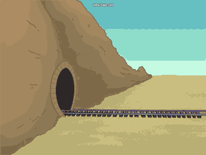

# Workflow Refactoring

## So sieht's aus:

## Was kann verbessert werden?

## Weniger "Trichter"
### ... es sind Flaschenhälse, die uns bremsen

## Weniger "Hüte"
### ... reduziert den Kommunikations-Overhead

## So könnte es gehen:

# Cross-funktionale Teams
<blockquote>Wir organisieren die Entwickler nicht mehr um Technologien, sondern um Projekte.</blockquote>

## Weniger <u>Herumfragen</u> und <u>Suchen</u> nach Informationen.

## <u>Direkte</u> Entscheidungen.

## Mehr <u>Zusammenarbeit</u> zwischen PHP, GWT & Client.

## Gemeinsam lernen durch projektbezogene, <u>teamübergreifende Retrospektiven</u>.

## Nach und nach die Gräben zuschütten.

## Weniger "die" und "wir", mehr "gemeinsam".

# Was wird aus dem GWT-Team?

## Ein neues Selbstverständnis

# Die "GWT-Gilde"
### Die Spezialisten ihres Handwerks

# How to keep in touch?
### Informationen, neue Funktionen, Code-Änderungen, Best Practices, Probleme, Verbesserungen, ...

### usw.

# Code Reviews

# Blog

# Retrospektiven

# Neu: Styleguide

# Verteilung der GWT-Entwickler auf Projekte
## Eine "maritime Metapher"
### (weil ich Ostfriese bin)

##Im Hafen:
###Kapitäne suchen Matrosen für ihr Schiff

## Das ist ein "Push-System" ...

## Push-System =

## Alternative?

## Die "Matrosen-Börse"

## Wieder im Hafen:
### Die Matrosen suchen sich ihre Schiffe selbst

## ... das ist ein "Pull-System".

## Pull-System =

## Was hat das mit uns zu tun?!

## Konkret kann das so aussehen:

## Das Projekt-Post-It

- Ein Post-It pro benötigtem UI-Entwickler
- Mehrbedarf? Projektleiter hängt ein Post-It dazu!
- Board hängt neben dem GWT-Board. Übersicht bleibt erhalten!

### Danke für eure Aufmerksamkeit.

# Fragen?
# Sorgen?
# Feedback?